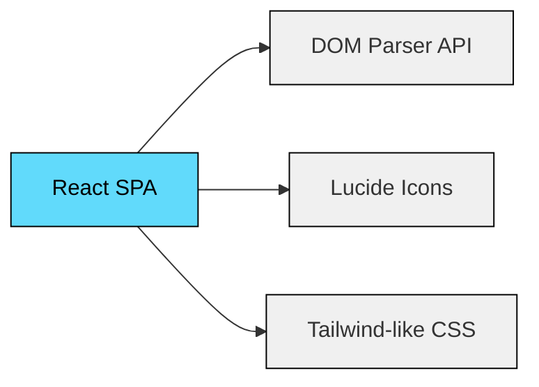

# Análisis del Prototipo "Schindler"
## Oracle Forms Migration Architect

> **Fecha de Análisis**: 7 de febrero de 2026  
> **Estado del Proyecto**: Prototipo funcional (Frontend UI únicamente)  
> **Objetivo**: Base de documentación para desarrollo y mejoras futuras

---

## 📋 Resumen Ejecutivo

**Schindler** es un prototipo de aplicación web diseñada como herramienta de arquitectura para la **migración de Oracle Forms a tecnologías modernas** (React + NestJS + Oracle ORDS). La aplicación actual es una Single Page Application (SPA) desarrollada en React que proporciona una interfaz de usuario completa pero sin funcionalidad backend implementada.

### Propósito de la Aplicación

La herramienta está diseñada para:
1. **Analizar archivos XML exportados de Oracle Forms** (.FMB convertidos a XML)
2. **Extraer metadatos** de bloques, triggers y program units
3. **Generar análisis de complejidad** para estimar esfuerzo de migración
4. **Recomendar estrategias de migración** basadas en patrones detectados
5. **Proponer servicios REST** (ORDS/BFF) para cada bloque de datos
6. **Integrar con Azure DevOps** para crear tickets de trabajo

---

## 🏗️ Arquitectura Actual

### Stack Tecnológico Implementado



| Tecnología | Uso | Estado |
|------------|-----|--------|
| **React 18+** | Framework frontend | ✅ Implementado |
| **Lucide React** | Sistema de iconos | ✅ Implementado |
| **DOMParser API** | Parsing de XML | ✅ Implementado |
| **Inline CSS (Tailwind-style)** | Estilos | ✅ Implementado |
| **FileReader API** | Upload de archivos | ✅ Implementado |

### Estructura de Componentes

```
App (Main Component)
├── Header (Navigation)
│   ├── Upload Tab
│   ├── Analysis Tab
│   └── Config Tab
├── Upload View
│   └── File Input Component
├── Analysis View
│   ├── Metrics Cards (x4)
│   ├── Code Structures Panel
│   │   ├── Program Units List
│   │   └── Triggers List
│   └── Recommendations Panel
│       ├── Best Practices
│       └── Proposed Services (ORDS)
└── Configuration View
    ├── MCP Settings
    ├── ORDS Settings
    └── Azure DevOps Integration
```

---

## ✅ Funcionalidades Implementadas

### 1. Carga y Parsing de Archivos XML

**Ubicación**: `handleFileUpload()` + `parseFormsXml()`

```javascript
// Lectura de archivo
const reader = new FileReader();
reader.readAsText(file);

// Parsing XML usando DOMParser
const parser = new DOMParser();
const xmlDoc = parser.parseFromString(xmlText, "text/xml");
```

**Características**:
- ✅ Upload mediante `<input type="file">`
- ✅ Validación de tipo `.xml`
- ✅ Parseo de elementos XML: `Block`, `Trigger`, `ProgramUnit`
- ✅ Extracción de atributos: `Name`, `QueryDataSourceName`
- ✅ Conteo de líneas de código PL/SQL

### 2. Análisis de Complejidad

**Ubicación**: `generateAnalysis()`

**Algoritmo de Scoring**:
```
Complejidad = (Triggers × 5) + (ProgramUnits × 10) + (LOC ÷ 10)
```

**Categorización**:
- 0-100: Baja
- 101-200: Media
- 201-500: Alta
- 500+: Muy Alta

**Recomendaciones automáticas**:
- LOC > 1000 → Migrar a Stored Procedures
- Triggers `WHEN-VALIDATE` → Validaciones en NestJS (Zod/Class Validator)
- Bloques > 5 → Dividir en componentes React independientes

### 3. Propuesta de Servicios REST

**Ubicación**: `generateAnalysis()` - sección `services`

Para cada bloque de datos:
- Sugiere endpoints REST: `GET /{blockname}`
- Simula existencia en ORDS (random)
- Propone URIs ORDS: `ords/schema/v1/{blockname}`
- Identifica bloques sin servicio REST

### 4. Interfaz de Usuario

**Tecnología**: CSS inline (Tailwind-style utility classes)

**Características visuales**:
- ✅ Diseño responsive (Mobile-first con `md:grid-cols-*`)
- ✅ Esquema de colores profesional (Slate 50-900)
- ✅ Iconografía consistente (Lucide React)
- ✅ Sistema de mensajes (Success/Error notifications)
- ✅ Estados de carga (Loading spinner con `animate-pulse`)
- ✅ Tabs de navegación

**Pantallas**:
1. **Upload**: Drag-and-drop visual con CTA prominente
2. **Analysis**: Dashboard con métricas, código fuente y recomendaciones
3. **Config**: Formulario de configuración de servicios

### 5. Sistema de Configuración

**Ubicación**: Estado `config` + `saveConfig()`

**Parámetros configurables**:
- MCP URL (Model Context Protocol server)
- ORDS Base URL
- Azure DevOps (Org, Project, PAT)

> [!WARNING]
> **Estado actual**: La configuración solo se guarda en memoria (localStorage no implementado). Se pierde al recargar la página.

---

## ❌ Funcionalidades NO Implementadas

### 1. Backend / API Layer

> [!CAUTION]
> **Sin backend funcional**: Toda la lógica es frontend únicamente.

**Faltante**:
- Sin servidor NestJS
- Sin integración real con ORDS
- Sin conexión a Base de Datos Oracle
- Sin autenticación/autorización
- Sin persistencia de datos

### 2. Integraciones Externas

| Integración | Estado | Notas |
|-------------|--------|-------|
| **Azure DevOps API** | ❌ No funcional | Botón "Crear ticket" es simulado |
| **Oracle ORDS** | ❌ No funcional | Verificación de existencia es `Math.random()` |
| **MCP Server** | ❌ No definido | Campo de configuración sin uso |

### 3. Persistencia de Datos

- ❌ Sin base de datos
- ❌ Sin localStorage/sessionStorage
- ❌ Sin cache del lado del cliente
- ❌ Historial de análisis no se guarda

### 4. Generación de Código Automatizada

**Potencial detectado pero no implementado**:
- Generación de módulos NestJS (Controllers, Services, DTOs)
- Generación de componentes React
- Generación de Stored Procedures Oracle
- Generación de manifests ORDS

### 5. Testing y Validación

- ❌ Sin unit tests
- ❌ Sin integration tests
- ❌ Sin validación robusta de XML (manejo de errores básico)
- ❌ Sin validación de schemas XML

### 6. Exportación de Reportes

- ❌ No se puede exportar el análisis (PDF, Excel, JSON)
- ❌ No hay visualización de diagramas de arquitectura
- ❌ Sin comparación entre múltiples análisis

---

## 🔍 Análisis Técnico Detallado

### Fortalezas del Prototipo

#### 1. **Diseño de UI Moderno y Coherente**
- Sistema de diseño consistente basado en Tailwind principles
- Responsive design bien implementado
- Jerarquía visual clara con cards y paneles

#### 2. **Parsing XML Robusto**
```javascript
// Extracción eficiente de múltiples niveles jerárquicos
const blocks = Array.from(xmlDoc.getElementsByTagName("Block"))
    .map(b => ({
        name: b.getAttribute("Name"),
        queryDataSource: b.getAttribute("QueryDataSourceName") || "N/A",
        items: b.getElementsByTagName("Item").length
    }));
```

#### 3. **Estado React Bien Estructurado**
- Separación clara de concerns (upload, parsing, analysis, config)
- Flujo unidireccional de datos
- Estado local apropiado para un prototipo

#### 4. **Análisis de Complejidad Inteligente**
- Algoritmo de scoring razonable
- Recomendaciones contextuales basadas en patrones

### Debilidades Técnicas

#### 1. **Monolito Frontend**
- Todo en un solo archivo `App.js` (382 líneas)
- Sin separación de componentes reutilizables
- Sin custom hooks para lógica compartida

#### 2. **Sin Manejo de Errores**
```javascript
// Ejemplo: parseFormsXml no valida si el XML es válido
const parser = new DOMParser();
const xmlDoc = parser.parseFromString(xmlText, "text/xml");
// ¿Qué pasa si xmlDoc.getElementsByTagName("Module")[0] es undefined?
```

#### 3. **Configuración No Persistente**
- Estado volátil (se pierde al recargar)
- Sin variables de entorno (.env)
- Valores hardcoded (`http://localhost:8080`)

#### 4. **Simulaciones en Lugar de Integraciones Reales**
```javascript
// Línea 117: Simulación de existencia en ORDS
existsInOrds: Math.random() > 0.5,
```

#### 5. **Sin Tipado (JavaScript Puro)**
- Propenso a errores en tiempo de ejecución
- Difícil de mantener a medida que crece
- Sin autocompletado robusto en IDEs

---

## 🚀 Roadmap de Desarrollo

### Fase 1: Fundaciones (Semanas 1-2)

#### A. Migración a TypeScript
**Prioridad**: 🔴 Crítica

**Beneficios**:
- Type safety en compilación
- Mejor experiencia de desarrollo
- Refactoring más seguro

**Tareas**:
- [ ] Renombrar `App.js` → `App.tsx`
- [ ] Crear interfaces para `ParsedData`, `Analysis`, `Config`
- [ ] Añadir tipos a funciones
- [ ] Configurar `tsconfig.json`

**Ejemplo de tipo**:
```typescript
interface Block {
  name: string;
  queryDataSource: string;
  items: number;
}

interface ParsedData {
  moduleName: string;
  blocks: Block[];
  triggers: Trigger[];
  programUnits: ProgramUnit[];
  stats: Stats;
}
```

#### B. Refactorización de Componentes
**Prioridad**: 🟡 Alta

**Estructura propuesta**:
```
src/
├── components/
│   ├── layout/
│   │   ├── Header.tsx
│   │   └── Layout.tsx
│   ├── upload/
│   │   ├── FileUpload.tsx
│   │   └── UploadView.tsx
│   ├── analysis/
│   │   ├── MetricsCard.tsx
│   │   ├── CodeStructuresPanel.tsx
│   │   ├── RecommendationsPanel.tsx
│   │   └── AnalysisView.tsx
│   └── config/
│       ├── ConfigForm.tsx
│       └── ConfigView.tsx
├── hooks/
│   ├── useXmlParser.ts
│   ├── useComplexityAnalysis.ts
│   └── useConfig.ts
├── types/
│   └── index.ts
└── utils/
    ├── xmlParser.ts
    └── complexityCalculator.ts
```

#### C. Gestión de Estado con Context API
**Prioridad**: 🟡 Alta

**Implementación**:
```typescript
// contexts/AppContext.tsx
interface AppContextType {
  parsedData: ParsedData | null;
  analysis: Analysis | null;
  config: Config;
  setConfig: (config: Config) => void;
}

export const AppProvider: React.FC = ({ children }) => {
  // ...state management
};
```

### Fase 2: Backend y APIs (Semanas 3-5)

#### A. Desarrollo del Backend NestJS
**Prioridad**: 🔴 Crítica

**Stack**:
- NestJS (Framework Node.js)
- TypeORM (ORM para Oracle)
- Oracle Database
- ORDS Integration

**Estructura de módulos**:
```
backend/
├── src/
│   ├── modules/
│   │   ├── xml-analysis/
│   │   │   ├── xml-analysis.controller.ts
│   │   │   ├── xml-analysis.service.ts
│   │   │   └── dto/
│   │   ├── ords-integration/
│   │   │   ├── ords.service.ts
│   │   │   └── ords.client.ts
│   │   ├── devops/
│   │   │   ├── devops.controller.ts
│   │   │   └── devops.service.ts
│   │   └── code-generation/
│   │       ├── generators/
│   │       │   ├── react.generator.ts
│   │       │   ├── nestjs.generator.ts
│   │       │   └── plsql.generator.ts
│   │       └── templates/
│   └── common/
│       ├── decorators/
│       └── filters/
```

**Endpoints a implementar**:
- `POST /api/analysis/upload` - Upload y análisis de XML
- `GET /api/analysis/:id` - Obtener análisis guardado
- `GET /api/ords/services` - Listar servicios ORDS disponibles
- `POST /api/devops/tickets` - Crear tickets en Azure DevOps
- `POST /api/generate/component` - Generar código React
- `POST /api/generate/service` - Generar NestJS service

#### B. Integración con Oracle ORDS
**Prioridad**: 🟡 Alta

**Implementación**:
```typescript
// ords.service.ts
@Injectable()
export class OrdsService {
  async checkServiceExists(moduleName: string): Promise<boolean> {
    const response = await axios.get(
      `${this.config.ordsBaseUrl}/metadata/catalog/schemas`
    );
    return response.data.items.some(item => 
      item.name.toLowerCase() === moduleName.toLowerCase()
    );
  }
  
  async getServiceDetails(uri: string): Promise<OrdsService> {
    // Implementación real de consulta ORDS
  }
}
```

#### C. Integración con Azure DevOps
**Prioridad**: 🟢 Media

**Biblioteca**: `azure-devops-node-api`

```typescript
import * as azdev from 'azure-devops-node-api';

@Injectable()
export class DevOpsService {
  async createWorkItem(config: DevOpsConfig, data: WorkItemData) {
    const authHandler = azdev.getPersonalAccessTokenHandler(config.pat);
    const connection = new azdev.WebApi(config.orgUrl, authHandler);
    const witApi = await connection.getWorkItemTrackingApi();
    
    const patchDocument = [
      { op: 'add', path: '/fields/System.Title', value: data.title },
      { op: 'add', path: '/fields/System.Description', value: data.description }
    ];
    
    return await witApi.createWorkItem({}, patchDocument, config.project, 'Task');
  }
}
```

### Fase 3: Persistencia y Historial (Semana 6)

#### A. Base de Datos Oracle

**Schema propuesto**:
```sql
-- Tabla de análisis
CREATE TABLE analysis_history (
  id VARCHAR2(36) PRIMARY KEY,
  module_name VARCHAR2(200) NOT NULL,
  upload_date TIMESTAMP DEFAULT CURRENT_TIMESTAMP,
  xml_content CLOB,
  complexity_score NUMBER,
  complexity_level VARCHAR2(20),
  total_blocks NUMBER,
  total_triggers NUMBER,
  total_program_units NUMBER,
  total_loc NUMBER
);

-- Tabla de bloques detectados
CREATE TABLE detected_blocks (
  id VARCHAR2(36) PRIMARY KEY,
  analysis_id VARCHAR2(36) REFERENCES analysis_history(id),
  block_name VARCHAR2(200),
  query_data_source VARCHAR2(200),
  items_count NUMBER,
  suggested_endpoint VARCHAR2(500),
  ords_exists NUMBER(1),
  ords_uri VARCHAR2(500)
);

-- Tabla de recomendaciones
CREATE TABLE recommendations (
  id VARCHAR2(36) PRIMARY KEY,
  analysis_id VARCHAR2(36) REFERENCES analysis_history(id),
  recommendation_type VARCHAR2(50),
  description CLOB,
  priority NUMBER
);
```

#### B. LocalStorage para Configuración
```typescript
// hooks/usePersistedConfig.ts
export const usePersistedConfig = () => {
  const [config, setConfig] = useState<Config>(() => {
    const saved = localStorage.getItem('schindler_config');
    return saved ? JSON.parse(saved) : DEFAULT_CONFIG;
  });
  
  useEffect(() => {
    localStorage.setItem('schindler_config', JSON.stringify(config));
  }, [config]);
  
  return [config, setConfig] as const;
};
```

### Fase 4: Generación de Código (Semanas 7-8)

#### A. Templates de Código

**React Component Template**:
```typescript
// templates/react-component.template.ts
export const generateReactComponent = (block: Block): string => `
import React, { useState, useEffect } from 'react';
import { use${block.name}Service } from '../services/${block.name.toLowerCase()}.service';

interface ${block.name}Props {
  id?: string;
}

export const ${block.name}Component: React.FC<${block.name}Props> = ({ id }) => {
  const [data, setData] = useState(null);
  const [loading, setLoading] = useState(false);
  
  useEffect(() => {
    // Fetch data logic
  }, [id]);
  
  return (
    <div className="p-4">
      {/* Component UI */}
    </div>
  );
};
`;
```

**NestJS Service Template**:
```typescript
// templates/nestjs-service.template.ts
export const generateNestService = (block: Block): string => `
import { Injectable } from '@nestjs/common';
import { InjectRepository } from '@nestjs/typeorm';
import { Repository } from 'typeorm';

@Injectable()
export class ${block.name}Service {
  constructor(
    @InjectRepository(${block.name}Entity)
    private readonly repository: Repository<${block.name}Entity>,
  ) {}
  
  async findAll(): Promise<${block.name}Entity[]> {
    return this.repository.find();
  }
  
  async findOne(id: string): Promise<${block.name}Entity> {
    return this.repository.findOne({ where: { id } });
  }
}
`;
```

#### B. Exportación de Código
```typescript
// Generar ZIP con código
import JSZip from 'jszip';

const exportProject = async (analysis: Analysis) => {
  const zip = new JSZip();
  
  analysis.services.forEach(service => {
    zip.file(
      `components/${service.block}.tsx`,
      generateReactComponent(service)
    );
    zip.file(
      `backend/services/${service.block}.service.ts`,
      generateNestService(service)
    );
  });
  
  const blob = await zip.generateAsync({ type: 'blob' });
  saveAs(blob, `${analysis.moduleName}-migration.zip`);
};
```

### Fase 5: Mejoras UX y Reporting (Semanas 9-10)

#### A. Visualizaciones Avanzadas

**Librería**: Recharts o Chart.js

```typescript
import { BarChart, Bar, XAxis, YAxis, Tooltip, Legend } from 'recharts';

const ComplexityChart = ({ data }) => (
  <BarChart width={500} height={300} data={data}>
    <XAxis dataKey="name" />
    <YAxis />
    <Tooltip />
    <Legend />
    <Bar dataKey="triggers" fill="#8884d8" />
    <Bar dataKey="programUnits" fill="#82ca9d" />
  </BarChart>
);
```

#### B. Exportación de Reportes

**Formato PDF usando `jspdf` + `html2canvas`**:
```typescript
import jsPDF from 'jspdf';
import html2canvas from 'html2canvas';

const exportPDF = async () => {
  const element = document.getElementById('analysis-report');
  const canvas = await html2canvas(element);
  const imgData = canvas.toDataURL('image/png');
  
  const pdf = new jsPDF();
  pdf.addImage(imgData, 'PNG', 0, 0);
  pdf.save(`analysis-${Date.now()}.pdf`);
};
```

**Formato Excel usando `xlsx`**:
```typescript
import * as XLSX from 'xlsx';

const exportExcel = (analysis: Analysis) => {
  const worksheet = XLSX.utils.json_to_sheet(analysis.services);
  const workbook = XLSX.utils.book_new();
  XLSX.utils.book_append_sheet(workbook, worksheet, 'Services');
  XLSX.writeFile(workbook, `analysis-${Date.now()}.xlsx`);
};
```

#### C. Comparación de Análisis
```typescript
// Feature: Comparar dos análisis de módulos
interface ComparisonResult {
  module1: string;
  module2: string;
  complexityDiff: number;
  sharedBlocks: string[];
  uniqueToModule1: string[];
  uniqueToModule2: string[];
}
```

---

## 🛠️ Recomendaciones de Mejora Inmediatas

### Prioridad 1: Configuración del Proyecto

#### Setup Completo de React + TypeScript

**package.json mínimo**:
```json
{
  "name": "schindler",
  "version": "1.0.0",
  "scripts": {
    "dev": "vite",
    "build": "tsc && vite build",
    "preview": "vite preview",
    "lint": "eslint . --ext ts,tsx",
    "test": "vitest"
  },
  "dependencies": {
    "react": "^18.2.0",
    "react-dom": "^18.2.0",
    "lucide-react": "^0.263.1",
    "axios": "^1.6.0",
    "react-router-dom": "^6.20.0"
  },
  "devDependencies": {
    "@types/react": "^18.2.0",
    "@types/react-dom": "^18.2.0",
    "@vitejs/plugin-react": "^4.2.0",
    "typescript": "^5.3.0",
    "vite": "^5.0.0",
    "vitest": "^1.0.0",
    "eslint": "^8.55.0",
    "prettier": "^3.1.0"
  }
}
```

#### Variables de Entorno

**`.env.example`**:
```env
VITE_API_URL=http://localhost:3000/api
VITE_ORDS_BASE_URL=https://oracle-ords.internal/api/v1
VITE_MCP_URL=http://localhost:8080
VITE_DEVOPS_ORG_URL=https://dev.azure.com/your-org
```

**Uso en código**:
```typescript
const API_URL = import.meta.env.VITE_API_URL;
```

### Prioridad 2: Manejo de Errores

```typescript
// utils/xmlParser.ts
export const parseFormsXml = (xmlText: string): ParsedData => {
  try {
    const parser = new DOMParser();
    const xmlDoc = parser.parseFromString(xmlText, 'text/xml');
    
    // Verificar errores de parsing
    const parseError = xmlDoc.querySelector('parsererror');
    if (parseError) {
      throw new Error('XML inválido: ' + parseError.textContent);
    }
    
    const moduleElement = xmlDoc.getElementsByTagName('Module')[0];
    if (!moduleElement) {
      throw new Error('No se encontró elemento <Module> en el XML');
    }
    
    // ... resto del parsing
    
  } catch (error) {
    console.error('Error al parsear XML:', error);
    throw new Error(`Error de parsing: ${error.message}`);
  }
};
```

### Prioridad 3: Testing

#### Unit Tests con Vitest

```typescript
// __tests__/xmlParser.test.ts
import { describe, it, expect } from 'vitest';
import { parseFormsXml } from '../utils/xmlParser';

describe('parseFormsXml', () => {
  it('should parse valid Forms XML', () => {
    const validXml = `
      <Module Name="TEST_MODULE">
        <Block Name="BLOCK1" QueryDataSourceName="TABLE1">
          <Item Name="FIELD1"/>
        </Block>
      </Module>
    `;
    
    const result = parseFormsXml(validXml);
    
    expect(result.moduleName).toBe('TEST_MODULE');
    expect(result.blocks).toHaveLength(1);
    expect(result.blocks[0].name).toBe('BLOCK1');
  });
  
  it('should throw error on invalid XML', () => {
    const invalidXml = '<invalid>';
    expect(() => parseFormsXml(invalidXml)).toThrow();
  });
});
```

#### Integration Tests

```typescript
// __tests__/api/analysis.test.ts
import { describe, it, expect, beforeAll } from 'vitest';
import axios from 'axios';

describe('Analysis API', () => {
  beforeAll(() => {
    // Setup test server
  });
  
  it('should create analysis from XML upload', async () => {
    const formData = new FormData();
    formData.append('file', xmlBlob, 'test.xml');
    
    const response = await axios.post('/api/analysis/upload', formData);
    
    expect(response.status).toBe(201);
    expect(response.data).toHaveProperty('id');
    expect(response.data).toHaveProperty('complexityScore');
  });
});
```

### Prioridad 4: Validación de Schemas

**Librería**: Zod

```typescript
import { z } from 'zod';

const BlockSchema = z.object({
  name: z.string().min(1),
  queryDataSource: z.string(),
  items: z.number().int().nonnegative()
});

const ParsedDataSchema = z.object({
  moduleName: z.string().min(1),
  blocks: z.array(BlockSchema),
  triggers: z.array(TriggerSchema),
  programUnits: z.array(ProgramUnitSchema),
  stats: StatsSchema
});

// Validación
const validatedData = ParsedDataSchema.parse(rawData);
```

---

## 📊 Estimación de Esfuerzo

| Fase | Duración | Complejidad | Recursos |
|------|----------|-------------|----------|
| **Fase 1**: Fundaciones | 2 semanas | Media | 1 dev frontend |
| **Fase 2**: Backend | 3 semanas | Alta | 1 dev fullstack |
| **Fase 3**: Persistencia | 1 semana | Media | 1 dev backend + DBA |
| **Fase 4**: Code Gen | 2 semanas | Alta | 1 dev senior |
| **Fase 5**: UX/Reporting | 2 semanas | Baja | 1 dev frontend |
| **Total** | **10 semanas** | | **2-3 devs** |

---

## 🎯 Quick Wins (Mejoras de Bajo Esfuerzo/Alto Impacto)

### 1. Persistir Configuración en LocalStorage
**Esfuerzo**: 30 minutos  
**Impacto**: Alto (UX)

```typescript
// Añadir al useEffect
useEffect(() => {
  const saved = localStorage.getItem('schindler_config');
  if (saved) setConfig(JSON.parse(saved));
}, []);

useEffect(() => {
  localStorage.setItem('schindler_config', JSON.stringify(config));
}, [config]);
```

### 2. Añadir Validación de XML
**Esfuerzo**: 1 hora  
**Impacto**: Alto (Robustez)

```typescript
const validateXml = (xmlDoc: Document): boolean => {
  if (xmlDoc.querySelector('parsererror')) return false;
  if (!xmlDoc.getElementsByTagName('Module')[0]) return false;
  return true;
};
```

### 3. Exportar Análisis como JSON
**Esfuerzo**: 30 minutos  
**Impacto**: Medio (Utilidad)

```typescript
const exportJSON = () => {
  const dataStr = JSON.stringify({ parsedData, analysis }, null, 2);
  const blob = new Blob([dataStr], { type: 'application/json' });
  const url = URL.createObjectURL(blob);
  const link = document.createElement('a');
  link.href = url;
  link.download = `analysis-${Date.now()}.json`;
  link.click();
};
```

### 4. Añadir Dark Mode
**Esfuerzo**: 2 horas  
**Impacto**: Medio (UX Premium)

```typescript
const [theme, setTheme] = useState<'light' | 'dark'>('light');

useEffect(() => {
  document.documentElement.classList.toggle('dark', theme === 'dark');
}, [theme]);
```

### 5. Historial de Archivos Analizados (Frontend Only)
**Esfuerzo**: 1 hora  
**Impacto**: Alto (UX)

```typescript
const [history, setHistory] = useState<AnalysisHistory[]>([]);

// Guardar en localStorage
const addToHistory = (analysis: Analysis) => {
  const newHistory = [
    { id: Date.now(), timestamp: new Date(), ...analysis },
    ...history.slice(0, 9) // Máximo 10 items
  ];
  setHistory(newHistory);
  localStorage.setItem('analysis_history', JSON.stringify(newHistory));
};
```

---

## 🔒 Consideraciones de Seguridad

### 1. Validación de Archivos
```typescript
const ALLOWED_FILE_SIZE = 10 * 1024 * 1024; // 10MB
const ALLOWED_MIME_TYPES = ['text/xml', 'application/xml'];

const validateFile = (file: File): boolean => {
  if (file.size > ALLOWED_FILE_SIZE) {
    throw new Error('Archivo demasiado grande');
  }
  if (!ALLOWED_MIME_TYPES.includes(file.type)) {
    throw new Error('Tipo de archivo no permitido');
  }
  return true;
};
```

### 2. Sanitización de Inputs
```typescript
import DOMPurify from 'dompurify';

const sanitizeXml = (xmlString: string): string => {
  return DOMPurify.sanitize(xmlString, { USE_PROFILES: { xml: true } });
};
```

### 3. Protección de Tokens
```typescript
// NUNCA guardar tokens en localStorage
// Usar httpOnly cookies o sessionStorage (menos seguro)

// Si es necesario en frontend:
const SENSITIVE_FIELDS = ['devOpsToken', 'apiKey'];
const saveConfigSecure = (config: Config) => {
  const sanitized = { ...config };
  SENSITIVE_FIELDS.forEach(field => delete sanitized[field]);
  localStorage.setItem('config', JSON.stringify(sanitized));
};
```

---

## 📚 Recursos y Referencias

### Documentación Técnica
- [React TypeScript Cheatsheet](https://react-typescript-cheatsheet.netlify.app/)
- [NestJS Documentation](https://docs.nestjs.com/)
- [Oracle ORDS API Reference](https://docs.oracle.com/en/database/oracle/oracle-rest-data-services/)
- [Azure DevOps REST API](https://learn.microsoft.com/en-us/rest/api/azure/devops/)

### Herramientas Recomendadas
- **IDE**: VSCode con extensiones React + TypeScript
- **Testing**: Vitest + React Testing Library
- **Linting**: ESLint + Prettier
- **API Client**: Postman/Insomnia para testing de APIs
- **Database Client**: Oracle SQL Developer / DBeaver

---

## 💡 Conclusiones

### Estado Actual
El prototipo Schindler es una **demostración visual sólida** del concepto de herramienta de migración Oracle Forms. La UI está bien diseñada y la lógica de parsing es funcional, pero **carece de backend y persistencia**.

### Valor del Prototipo
✅ **Excelente punto de partida** para:
- Validar la viabilidad del concepto
- Demostrar a stakeholders
- Probar UX con usuarios finales

### Siguiente Paso Crítico
> [!IMPORTANT]
> **Prioridad Máxima**: Implementar backend NestJS con conexión a ORDS y Base de Datos Oracle. Sin esto, la aplicación no pasa de ser un prototipo visual.

### Recomendación Final
Seguir el roadmap de 10 semanas en fases incrementales, validando cada fase antes de pasar a la siguiente. **Comenzar con Fase 1 (Fundaciones) inmediatamente** para establecer arquitectura sólida.

---

**Documento generado**: 2026-02-07  
**Versión**: 1.0  
**Próxima revisión**: Tras completar Fase 1
