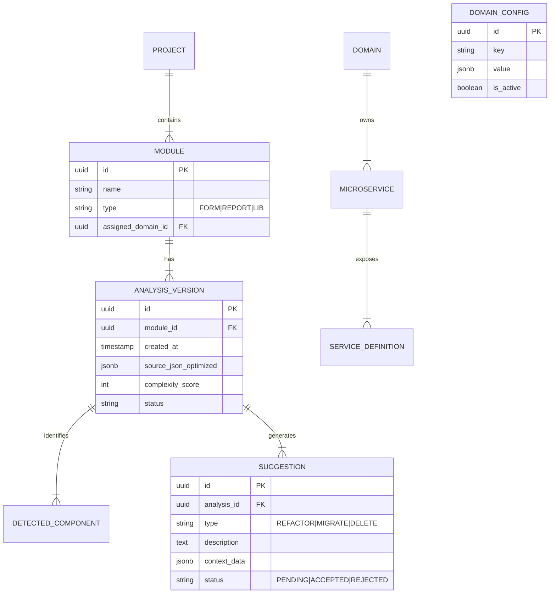

# Diseño de Persistencia y Datos
## Esquema de Base de Datos para Schindler

> **Objetivo**: Proveer un modelo de datos robusto para almacenar el conocimiento extraído de los Oracle Forms, configuraciones de gobernanza y el historial de análisis, permitiendo la colaboración entre equipos.

---

## 1. Estrategia de Almacenamiento

### 1.1. Motor de Base de Datos
Se recomienda **PostgreSQL** (versión 14+) o **Oracle Database** (19c+), debido a su soporte nativo para tipos de datos JSON, lo cual es crítico para almacenar la estructura flexible de los Forms transformados.

### 1.2. Hybrid Relational Model
Utilizaremos un enfoque híbrido:
*   **Relacional**: Para entidades estructurales (Proyectos, Usuarios, Dominios, Reglas).
*   **Documental (JSON)**: Para el contenido detallado de los Forms (Bloques, Triggers, Canvas) y metadatos variables.

---

## 2. Modelo de Datos (ERD)



---

## 3. Detalle de Tablas Principales

### 3.1. `ANALYSIS_VERSION` (El Corazón del Historial)
Cada vez que se sube/re-analiza un archivo XML, se crea una nueva versión.

| Columna | Tipo | Descripción |
|---------|------|-------------|
| `id` | UUID | Identificador único de la versión. |
| `module_id` | UUID | Referencia al módulo (archivo .fmb) original. |
| `source_metadata` | **JSONB/CLOB** | **Aquí se guarda el XML transformado.** Contiene la estructura completa pero limpia (sin ruido visual del XML original). |
| `raw_xml_hash` | VARCHAR | Hash SHA-256 del archivo original para detectar cambios/duplicados. |
| `summary_stats` | JSONB | Totales pre-calculados (num_blocks, num_lines, etc.) para dashboards rápidos. |

### 3.2. Formato de `source_metadata` (El XML Optimizado)
En lugar de guardar el XML crudo y pesado, guardamos una versión JSON normalizada (AST - Abstract Syntax Tree simplificado).

**Ejemplo de almacenamiento:**
```json
{
  "moduleName": "VENTAS_F01",
  "blocks": [
    {
      "name": "ORDER_ITEMS",
      "dataSource": "TBL_ORDER_ITEMS",
      "items": [
        { "name": "QTY", "type": "NUMBER", "required": true }
      ],
      "triggers": ["WHEN-VALIDATE-ITEM", "POST-QUERY"]
    }
  ],
  "dependencies": ["LIB_COMMON.PLL", "LIB_SALES.PLL"]
}
```

### 3.3. `DOMAIN_CONFIG` & `MICROSERVICE_REGISTRY`
Tablas para la gobernanza centralizada.

**`MICROSERVICES`**:
*   `id`: `ms-sales`
*   `domain`: `Ventas`
*   `base_url`: `https://api.schindler.internal/sales`
*   `team_owner`: `Squad Alpha`

**`TABLE_MAPPINGS`** (Reglas de asignación):
*   `table_name_pattern`: `VTA_%`
*   `target_microservice_id`: `ms-sales`

---

## 4. Flujo de Datos en el Backend

1.  **Ingesta**: El frontend envía el archivo XML al endpoint `POST /api/analysis`.
2.  **Transformación**:
    *   El backend parsea el XML en memoria.
    *   Extrae metadatos relevantes.
    *   Convierte la estructura a JSON (eliminando detalles gráficos irrelevantes como coordenadas X/Y en canvas).
3.  **Persistencia**:
    *   Verifica si el hash del XML ya existe.
    *   Si es nuevo, inserta en `ANALYSIS_VERSION`.
    *   Guarda el JSON optimizado en `source_metadata`.
4.  **Generación de Sugerencias**:
    *   Un proceso asíncrono lee el JSON guardado.
    *   Aplica reglas heuristics (ej. "Tabla X pertenece a Dominio Y").
    *   Inserta registros en `SUGGESTION`.

---

## 5. Ventajas de este Diseño

1.  **Eficiencia**: Consultar un campo JSONB indexado es mucho más rápido que volver a parsear XMLs de 50MB.
2.  **Transparencia**: Las sugerencias quedan guardadas y tienen estado (`ACCEPTED`/`REJECTED`), permitiendo auditoría de decisiones.
3.  **Agnosticismo**: El campo `source_metadata` puede evolucionar sin cambiar el esquema de la base de datos (Schema-on-read para detalles, Schema-on-write para estructura base).
4.  **Colaboración**: Múltiples usuarios pueden ver el mismo análisis sin tener que subir el archivo cada vez.

---

**Documento generado**: 2026-02-07

---

## 6. Decisión de Arquitectura: ¿Por qué Relacional Híbrida vs Documental (MongoDB)?

Para el caso específico de **Schindler**, donde combinamos **análisis flexible** con **gobernanza estricta**, la elección entre Relacional y Documental es crítica.

### Comparativa Directa

| Característica Crítica | MongoDB (Documental Puro) | PostgreSQL / Oracle (Relacional Híbrido) | Ganador para Schindler |
| :--- | :--- | :--- | :--- |
| **Gobernanza de Datos** | **Debil**: La integridad referencial (ej: asegurar que un Módulo pertenezca a un Dominio existente) debe validarse en código de aplicación. | **Fuerte**: Las `Foreign Keys` garantizan a nivel de base de datos que la estructura organizacional se respete siempre. | **Relacional (Híbrido)** |
| **Flexibilidad de Análisis** | **Excelente**: Esquema libre, ideal para guardar el resultado variable del parsing de XMLs complejos. | **Excelente**: Con tipos de datos `JSONB` (Postgres) o `JSON` (Oracle), se obtiene la misma flexibilidad dentro de una columna específica. | **Empate** |
| **Reportes Complejos** | **Difícil**: Los `JOINS` ($lookup) son menos eficientes y limitados para cruzar múltiples entidades de negocio. | **Nativo**: SQL permite cruzar fácilmente Proyectos, Dominios, Usuarios y Resultados de Análisis en una sola consulta. | **Relacional (Híbrido)** |
| **Transacciones** | Soportadas (pero con overhead en sharding). | ACID estricto por defecto. | **Relacional (Híbrido)** |

### Veredicto: El Modelo Híbrido es Superior
Para este proyecto, **NO recomendamos una base de datos puramente documental (Mongo)**.

La razón principal es la **Gobernanza**:
1.  Necesitas asegurar que los **Dominios**, **Microservicios** y **Proyectos** tengan relaciones consistentes. En Mongo, es fácil que queden referencias huérfanas (ej: un análisis apuntando a un dominio borrado).
2.  Las bases de datos relacionales modernas (PostgreSQL, Oracle 19c+) manejan JSON de forma nativa y eficiente. Esto nos da **"lo mejor de los dos mundos"**:
    *   **Tablas Relacionales** para la estructura organizacional (Proyectos, Usuarios, Dominios).
    *   **Columnas JSON** para el contenido flexible (El resultado del análisis del XML).

**Conclusión**: Usaremos PostgreSQL o Oracle Database.

