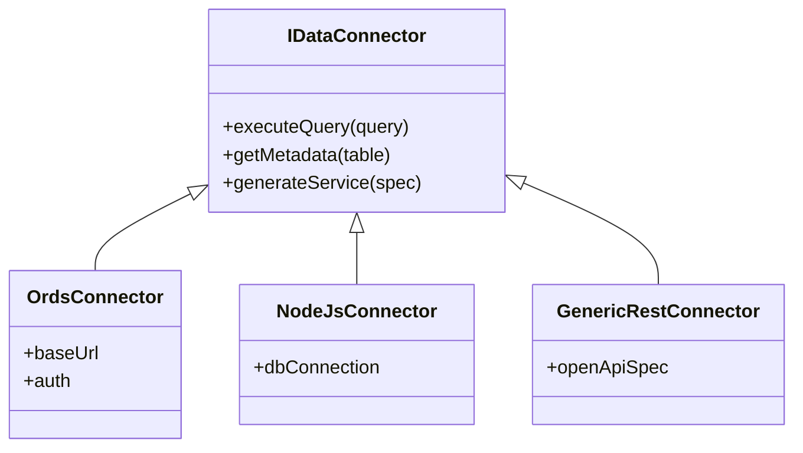

# Gobernanza y Procesos de Migración Escalable
## Arquitectura para Equipos Distribuidos

> **Objetivo**: Establecer un marco de trabajo que garantice la coherencia, reutilización y eficiencia en la migración masiva de Oracle Forms a Microservicios, permitiendo la colaboración de múltiples equipos sin colisiones.

---

## 1. Estrategia de Anti-Duplicidad y Reutilización

Para evitar que múltiples equipos creen servicios redundantes para los mismos datos, se implementará un sistema de **"Service Registry & Discovery"** en tiempo de diseño.

### 1.1. El Registro de Servicios (Service Registry)
Schindler actuará como cliente de un registro centralizado. Antes de proponer un nuevo servicio, consultará este registro.

**Mecanismo de Detección:**
1.  **Hashing de Fuente de Datos**: Al analizar un bloque, se genera un hash basado en `QueryDataSourceName` (Tabla/Vista) + Columnas clave.
2.  **Búsqueda en Catálogo**:
    *   Si el hash existe → **Alerta de Reutilización**: "El servicio `GET /clientes/{id}` ya expone estos datos. Úsalo en lugar de crear uno nuevo."
    *   Si no existe → **Propuesta de Nuevo Servicio**.

### 1.2. Niveles de Reutilización
Definimos 3 niveles de servicios para maximizar la reutilización:

| Nivel | Descripción | Ejemplo | Gobernanza |
|-------|-------------|---------|------------|
| **Core (Entity)** | CRUD básico sobre una entidad de negocio. | `GET /api/products/:id` | Propiedad de un solo Squad (Domain Owner). Otros solo consumen. |
| **Composite** | Agregación de datos de múltiples entidades para una vista específica. | `GET /api/dashboard/summary` | Puede ser creado por equipos de UI, pero debe usar servicios Core. |
| **BFF (Backend for Frontend)** | Lógica específica de presentación para una UX concreta. | `POST /api/mobile/login` | Propiedad del equipo de Frontend. |

### 1.3. Regla de Oro
> **"Dueño de los Datos ≠ Consumidor de los Datos"**
> Si un equipo necesita datos de `CLIENTES` pero está trabajando en el módulo de `FACTURACIÓN`, **NO** debe crear un servicio que acceda a la tabla `CLIENTES`. Debe consumir el API del dominio `CLIENTES`.

---

## 2. Arquitectura de Dominios (DDD) y Microservicios

Para asegurar que cada servicio encaje en el microservicio correcto, se utilizará un **Mapa de Dominios Predefinido**.

### 2.1. Configuración de Dominios
El sistema cargará un archivo de configuración `domains.json` que define los límites de cada microservicio.

```json
{
  "domains": [
    {
      "id": "ms-ventas",
      "name": "Gestión de Ventas",
      "tables": ["PEDIDOS", "DETALLE_PEDIDOS", "FACTURAS"],
      "prefix": "/api/sales"
    },
    {
      "id": "ms-inventario",
      "name": "Gestión de Inventario",
      "tables": ["PRODUCTOS", "KARDEX", "ALMACENES"],
      "prefix": "/api/inventory"
    }
  ]
}
```

### 2.2. Asignación Automática
Cuando Schindler analiza un Form:
1.  Identifica las tablas base de los bloques (`QueryDataSourceName`).
2.  Busca la tabla en el `domains.json`.
3.  **Sugerencia Inteligente**: "Este bloque pertenece al dominio **Ventas**. El servicio debe crearse en `ms-ventas` bajo el endpoint `/api/sales/orders`".

### 2.3. Manejo de Cruces de Dominio (Join Tables)
Si un bloque hace un JOIN entre tablas de `VENTAS` e `INVENTARIO`:
*   **Acción**: Se marca como un "Composite Service".
*   **Recomendación**: Crear un servicio en el dominio principal (ej. Ventas) que orqueste llamadas a los microservicios base, o usar GraphQL Federation si está disponible.

---

## 3. Backend Agnóstico (REST Adapter Pattern)

Para cumplir con el requerimiento de no atarse específicamente a ORDS, el backend de Schindler implementará el patrón **Strategy/Adapter**.

### 3.1. Arquitectura de Adaptadores



### 3.2. Configuración Dinámica
El usuario configurará el "Target Backend" en la UI:

*   **Opción A: Oracle ORDS**
    *   Genera PL/SQL para exponer REST services en la DB.
*   **Opción B: Java Spring Boot / NestJS**
    *   Genera Controllers y DTOs basados en OpenAPI.
*   **Opción C: Generic REST Wrapper**
    *   Configura un API Gateway para rutear tráfico a procedimientos existentes.

### 3.3. Contrato de Interfaz
Independientemente del backend, Schindler espera que el servicio resultante cumpla un contrato REST estándar:
*   `GET /resource` (List)
*   `GET /resource/{id}` (Detail)
*   `POST /resource` (Create)
*   `PUT/PATCH /resource/{id}` (Update)

---

## 4. Flujos de Trabajo Colaborativos (Workflows)

Proponemos un flujo de trabajo cíclico para los equipos de migración, inspirado en Gitflow.

### Workflow: "The Migration Pipeline"

#### Paso 1: Discovery & Claim (Analista Funcional + Tech Lead)
1.  Cargar `.FMB` (XML) en Schindler.
2.  Revisar análisis de complejidad.
3.  **Action**: "Claim" (Reclamar) el módulo en el sistema de gestión (Jira/Azure DevOps). Esto bloquea el módulo para evitar que otro equipo trabaje en él.

#### Paso 2: Domain Mapping (Arquitecto de Datos)
1.  Schindler sugiere dominios basados en tablas.
2.  Arquitecto valida/corrige la asignación.
3.  Se define si se usan servicios existentes (Reuso) o se crean nuevos.

#### Paso 3: Contract Design (Desarrollador Backend)
1.  Schindler genera la especificación OpenAPI (Swagger) del servicio propuesto.
2.  **Review**: El equipo de Gobierno de API revisa el contrato (naming conventions, tipos de datos).
3.  **Approval**: Una vez aprobado el contrato, se puede proceder a implementar.

#### Paso 4: Implementation (Paralelo)
*   **Track A (Backend)**: Implementa el servicio (en ORDS, Java, Node) cumpliendo el contrato OpenAPI.
*   **Track B (Frontend)**: Usa Schindler para generar los componentes React/Hooks que consumen ese contrato (usando Mocks inicialmente).

#### Paso 5: Integration & Verification
1.  Conectar Frontend real con Backend real.
2.  Ejecutar tests de integración.
3.  Schindler valida que todos los bloques del Form original tienen datos en la nueva UI.

---

## 5. Herramientas de Coordinación Recomendadas

Para que esta "máquina" funcione aceitada, se recomienda:

1.  **Backstage (Developer Portal)**:
    *   Catálogo central de servicios.
    *   Documentación técnica unificada.
    *   Plantillas (Scaffolding) para nuevos microservicios.
    
2.  **Spectral (API Linter)**:
    *   Validar automáticamente que los contratos OpenAPI generados cumplan los estándares de la empresa.
    
3.  **Pact (Contract Testing)**:
    *   Asegurar que los cambios en el backend no rompan el frontend.

---

## 6. Resumen de Cambios en Schindler

Para soportar este modelo, Schindler evolucionará:

1.  **Nuevo Módulo de "Gobernanza"**:
    *   Conexión a Catálogo de Servicios (API externa).
    *   Validación de duplicados.
2.  **Editor de Dominios**:
    *   UI para mapear Tablas <-> Microservicios.
3.  **Generador de Contratos OpenAPI**:
    *   Output principal del análisis (First-Contract Approach).
4.  **Backend Connector Interface**:
    *   Permitir plugins para distintos destinos (No solo ORDS).

---

**Documento generado**: 2026-02-07
**Estado**: Propuesta de Arquitectura
